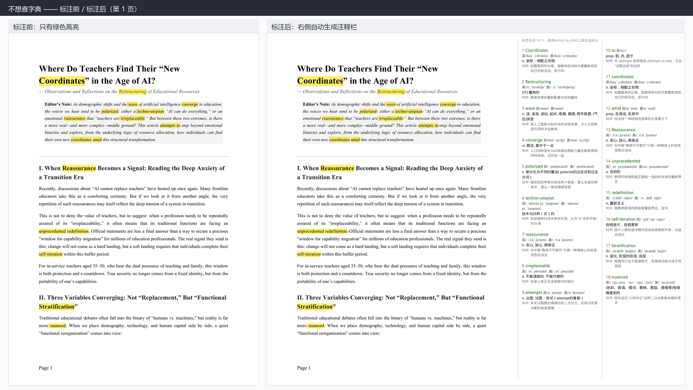
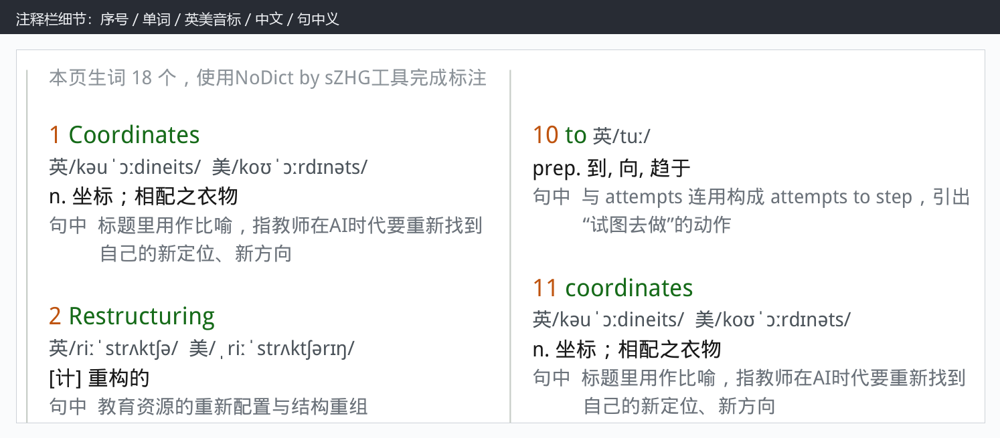
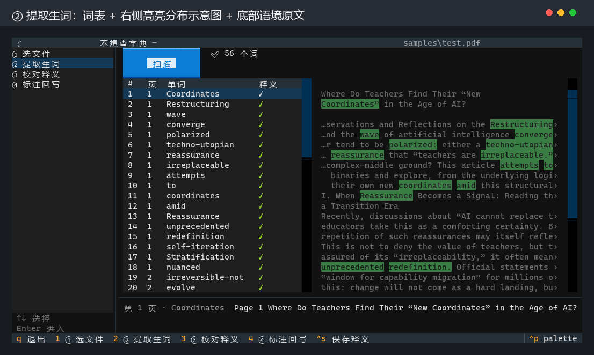
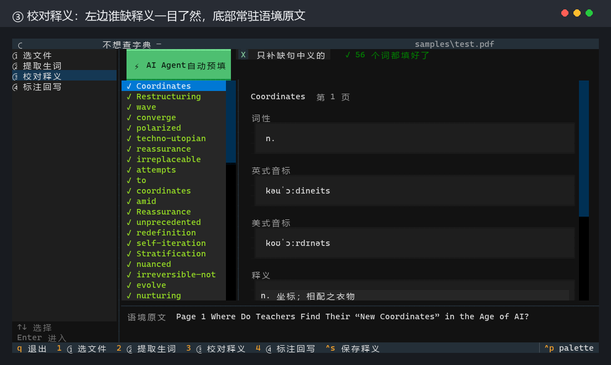
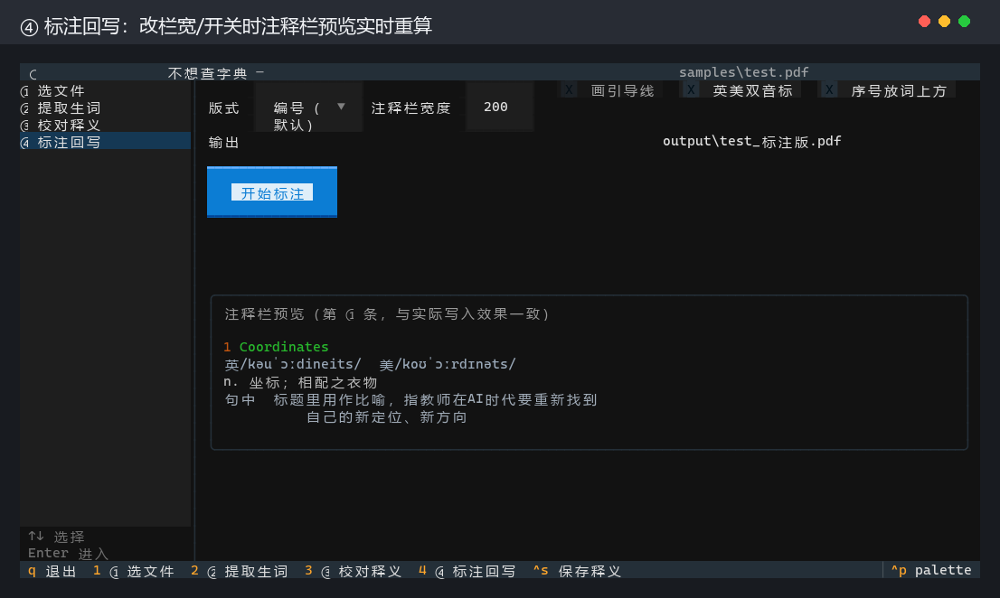

# NoDict 不想查字典

> 你在 PDF 里划过的生词，右边自动长出**音标、中文释义，和它在原文那句话里的意思**。
> 原文一个字都不动，出来的还是 PDF，照样打印、照样发。

适合四六级真题、外刊精读这类"边读边划生词"的资料。全部离线，不联网也能用。

**这个仓库只放打包好的安装包，不放源码。**

### 👉 [**下载最新版**](https://github.com/zlllw/NoDict-releases/releases/latest)

📺 **演示视频**：<https://www.bilibili.com/video/BV1Wnak6rEZT?vd_source=cc51142c809463bc9eb2f5303ce60262>

---

## 效果

### ① 标注前 → 标注后

左边是原始 PDF（只有你划的黄色高亮），右边是处理后的结果：

原文**一个字都没动**，只是每页向右加宽了 200pt 用来放注释栏。

### ② 注释栏细节

每条注释有五样东西：**序号 / 单词 / 英美音标 / 中文释义 / 句中义**：

那个序号是把注释和原文对上的钥匙——高亮词的**词尾**也印着同一个极小的序号。

### ③ 界面：四步走完

左边是步骤栏，四步随时来回跳。

**第 ② 步 · 提取生词**——词表 + 右侧高亮分布示意图，一眼看出哪一带被划得多：

**第 ③ 步 · 校对释义**——左边列出缺释义的词，右边填表，**底部常驻原文语境**：

**第 ④ 步 · 标注回写**——改栏宽、开关引导线时，注释栏预览实时重算：

---

## 下载与安装

去 [**Releases**](https://github.com/zlllw/NoDict-releases/releases/latest) 下载
`NoDict-v1.0.0-win64.zip`（约 24 MB），解压后三步：

### 1. 装 Python 3.14

<https://www.python.org/downloads/>

安装时**务必勾选** `Add python.exe to PATH`，否则后面全都不认。

> 必须是 **3.14**。包里的模块是按 3.14 的 ABI 编译的机器码，装 3.12 / 3.13 打不开。
> 启动器会先把这件事说清楚，不会让你对着一堆 `ImportError` 发呆。

### 2. 双击 `安装依赖.bat`

自动装 PyMuPDF 和 Textual，需要联网，约一两分钟。

### 3. 双击 `启动 NoDict.bat`

界面出来就成了。以后每次用都点这一个。

解压到哪都行。如果解压到了 `C:\Program Files` 这类没有写权限的地方，程序会自动把
校对成果和输出改存到 `%APPDATA%\NoDict`——**启动时会告诉你改存到哪了**，
不会闷声换地方。

### 几个说明

- **窗口别拉太窄。** 界面按 118 列排版，窄了会错位，启动时会提醒你。
- **第一次打开约 8 秒**（要把 63 MB 词典读进内存），之后每次查词都是瞬间的。
- **第 ③ 步的「自动预填」要自己配 API key 才能填「句中义」。**
  没配也能用，音标和通用释义照常从本地词典来，只是句中义要手填。
  想用的话，照着包里的 `data/词源配置.example.json` 建一个 `词源配置.json`。
- 只处理 PDF。**扫描件（图片型 PDF）没有文字层，取不到高亮原文。**

---

## 关于版权

**本工具保留所有权利。** 个人作品，打包分发只是方便使用，**不是开源软件**，
请不要二次分发或用于商业用途。

| 组件 | 许可 | 说明 |
|---|---|---|
| PyMuPDF | **AGPL-3.0** | 由你自己从 PyPI 安装，本包不含它 |
| ECDICT | MIT | 词典数据（63 万词条），可自由使用 |
| Textual | MIT | 终端界面框架 |

> ### 为什么 PyMuPDF 要自己装
>
> PyMuPDF 是 AGPL-3.0。把含它的二进制公开分发出去，AGPL 第 6 条就要求向每一位
> 接收者提供完整对应源码——**非商业使用不免除**这条义务。
>
> 让使用者自己从 PyPI 装，就没有发生"分发"，义务不成立。所以这个包刻意不带它。
> 代价是你得先装 Python。这是为了让"公开发布"和"源码不公开"能同时成立的交换，
> 不是能顺手绕过的细节。
>
> 如果你要把这个包再分发出去，需要先自己搞清楚 AGPL 的要求。
